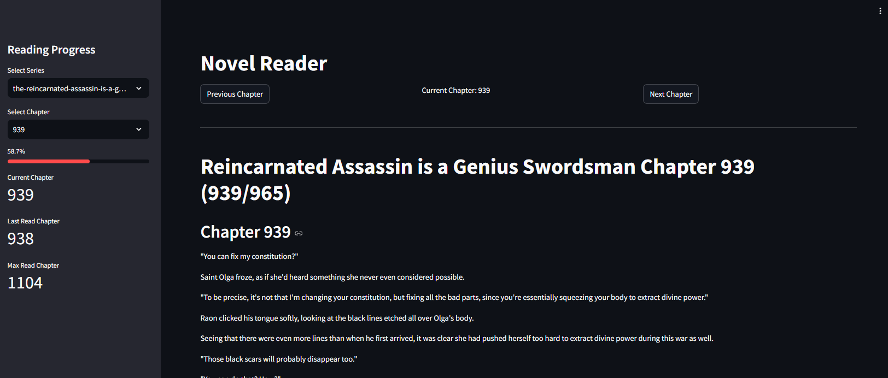

# Local Novel Reader

A simple, streamlined web application for reading novels locally on your computer. Built with Python and Streamlit, this application allows you to read and track your progress across multiple novel series.

## Features

- Clean, distraction-free reading interface
- Progress tracking across multiple novel series
- Easy chapter navigation
- Automatic progress saving
- Progress visualization with completion percentage
- Responsive layout that works on various screen sizes
- Download/Translate chapters from https://www.fortuneeternal.com/

## Screenshot


## Prerequisites

- Python 3.x
- pip (Python package manager)

## Installation

1. Clone this repository:
```bash
git clone https://github.com/yourusername/local-novel-reader.git
cd local-novel-reader
```

2. Install the required dependencies:
```bash
pip install -r requirements.txt
```

## Usage

1. Place your novel chapters in the `novel_chapters` directory using the following structure:
```
novel_chapters/
    series_name/
        chapter_1.txt
        chapter_2.txt
        chapter_3.txt
        ...
```
If you dont have the series and you want to download/translate check step 2

2. Find the Novel you want to translate

```bash
novel_scraper.py "<Series Name>" 1 10 --instructions-file novels\samplePrompt.txt
```

3. Run the application:
```bash
streamlit run filesReader.py
```

4. Access the application in your web browser (typically at http://localhost:8501)

5. You can read while the novel scraper is downloading content.

## Reading Progress

The application automatically tracks your reading progress:
- Last read chapter for each series
- Maximum chapter reached
- Overall progress percentage

## File Structure

- `filesReader.py` - Main application file with the Streamlit interface
- `novel_chapters/` - Directory containing novel series and their chapters
- `reading_progress.json` - JSON file storing reading progress data
- `requirements.txt` - Python dependencies

## Contributing

Feel free to fork this repository and submit pull requests for any improvements.

## License

This project is open source and available under the MIT License.